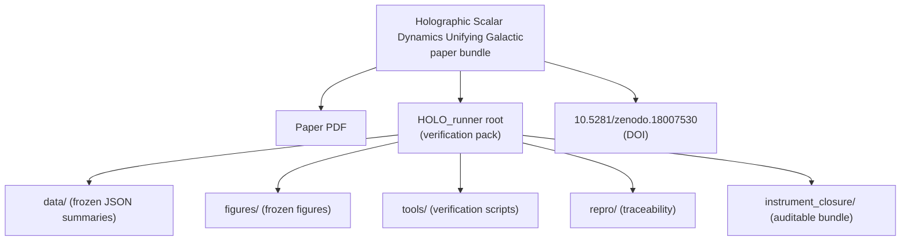

# Holographic Scalar Dynamics Unifying Galactic — paper PDF

This folder is a **paper bundle** containing the manuscript PDF:

- `Holographic Scalar Dynamics Unifying Galactic.pdf`
- DOI (Zenodo v2): [10.5281/zenodo.18007530](https://doi.org/10.5281/zenodo.18007530)

## Mermaid bundle map (clickable)

