# Instrumental eigenmode clock spectroscopy — frozen minimal artifacts

This folder is a **frozen minimal artifact pack** accompanying the preprint:

- `Instrumental Eigenmode Spectroscopy of a Holographic Einstein--Dilaton Bulk Using Optical Clocks.pdf`
- `Supplementary - Instrumental Eigenmode Spectroscopy of a Holographic Einstein--Dilaton Bulk Using Optical Clocks.pdf`
- Zenodo DOI (this version): [10.5281/zenodo.18213536](https://doi.org/10.5281/zenodo.18213536)

## Mermaid bundle map (clickable)

```mermaid
flowchart TD
  A["Instrumental eigenmode clock spectroscopy<br/>frozen minimal pack"] --> PDF["Preprint PDF"]
  A --> SUP["Supplementary PDF"]
  A --> DICT["Integrated temporal dictionary<br/>temporal_dictionary_integrated.json"]
  A --> TAB["Aggregated table<br/>mode_response_rows.json"]
  A --> WN["Audit examples (window-level)<br/>mode00/mode05 @ eps=0.02"]
  A --> Z["10.5281/zenodo.18213536<br/>(Zenodo record)"]

  WN --> W00N["mode00 / nist / eps_0.02<br/>window_sweep_report.json"]
  WN --> W00R["mode00 / rocit / eps_0.02<br/>window_sweep_report.json"]
  WN --> W05N["mode05 / nist / eps_0.02<br/>window_sweep_report.json"]
  WN --> W05R["mode05 / rocit / eps_0.02<br/>window_sweep_report.json"]

  click PDF "https://github.com/RAPIDENN/HOLO_runner/blob/master/Instrumental%20Eigenmode%20Spectroscopy%20of%20a%20Holographic%20Einstein--Dilaton%20Bulk%20Using%20Optical%20Clocks/Instrumental%20Eigenmode%20Spectroscopy%20of%20a%20Holographic%20Einstein--Dilaton%20Bulk%20Using%20Optical%20Clocks.pdf"
  click SUP "https://github.com/RAPIDENN/HOLO_runner/blob/master/Instrumental%20Eigenmode%20Spectroscopy%20of%20a%20Holographic%20Einstein--Dilaton%20Bulk%20Using%20Optical%20Clocks/Supplementary%20-%20Instrumental%20Eigenmode%20Spectroscopy%20of%20a%20Holographic%20Einstein--Dilaton%20Bulk%20Using%20Optical%20Clocks.pdf"
  click DICT "https://github.com/RAPIDENN/HOLO_runner/blob/master/Instrumental%20Eigenmode%20Spectroscopy%20of%20a%20Holographic%20Einstein--Dilaton%20Bulk%20Using%20Optical%20Clocks/temporal_dictionary_integrated.json"
  click TAB "https://github.com/RAPIDENN/HOLO_runner/blob/master/Instrumental%20Eigenmode%20Spectroscopy%20of%20a%20Holographic%20Einstein--Dilaton%20Bulk%20Using%20Optical%20Clocks/TEST_1/out/mode_response_matrix/mode_response_rows.json"
  click W00N "https://github.com/RAPIDENN/HOLO_runner/blob/master/Instrumental%20Eigenmode%20Spectroscopy%20of%20a%20Holographic%20Einstein--Dilaton%20Bulk%20Using%20Optical%20Clocks/TEST_1/out/mode_response_matrix/mode00/nist/eps_0.02/window_sweep_report.json"
  click W00R "https://github.com/RAPIDENN/HOLO_runner/blob/master/Instrumental%20Eigenmode%20Spectroscopy%20of%20a%20Holographic%20Einstein--Dilaton%20Bulk%20Using%20Optical%20Clocks/TEST_1/out/mode_response_matrix/mode00/rocit/eps_0.02/window_sweep_report.json"
  click W05N "https://github.com/RAPIDENN/HOLO_runner/blob/master/Instrumental%20Eigenmode%20Spectroscopy%20of%20a%20Holographic%20Einstein--Dilaton%20Bulk%20Using%20Optical%20Clocks/TEST_1/out/mode_response_matrix/mode05/nist/eps_0.02/window_sweep_report.json"
  click W05R "https://github.com/RAPIDENN/HOLO_runner/blob/master/Instrumental%20Eigenmode%20Spectroscopy%20of%20a%20Holographic%20Einstein--Dilaton%20Bulk%20Using%20Optical%20Clocks/TEST_1/out/mode_response_matrix/mode05/rocit/eps_0.02/window_sweep_report.json"
  click Z "https://doi.org/10.5281/zenodo.18213536"
```

## Included JSON (minimal; auditable)

Only a minimal set of machine-readable JSON files needed to reproduce the numerical values and figures in the manuscript is included:

1) **Aggregated table source (mode × group × ε)**

- `TEST_1/out/mode_response_matrix/mode_response_rows.json`

2) **Window-level audit examples (representative; no manual selection inside the report)**

- `TEST_1/out/mode_response_matrix/mode00/nist/eps_0.02/window_sweep_report.json`
- `TEST_1/out/mode_response_matrix/mode00/rocit/eps_0.02/window_sweep_report.json`
- `TEST_1/out/mode_response_matrix/mode05/nist/eps_0.02/window_sweep_report.json`
- `TEST_1/out/mode_response_matrix/mode05/rocit/eps_0.02/window_sweep_report.json`

3) **Integrated temporal dictionary**

- `temporal_dictionary_integrated.json`

## Notes

- No background trace files, kernels, solvers, or internal implementation code are included here.
- The included JSON files are intended to support independent inspection (re-plotting and value verification) under the fixed ex-ante protocol.
