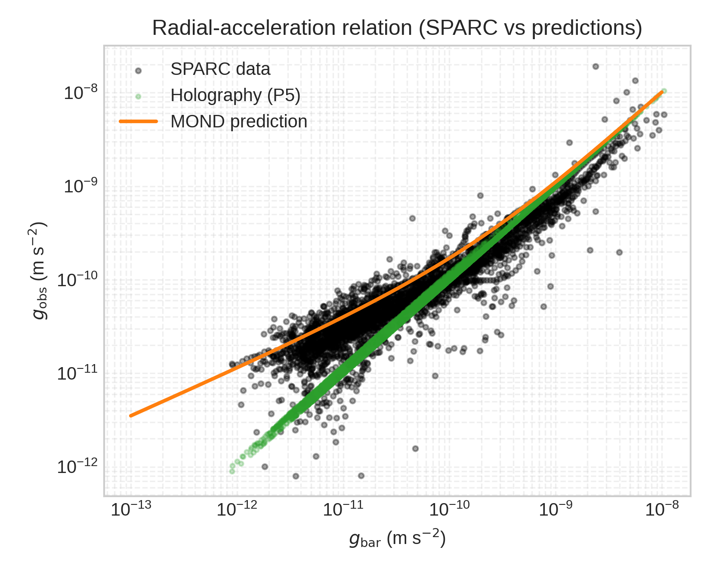
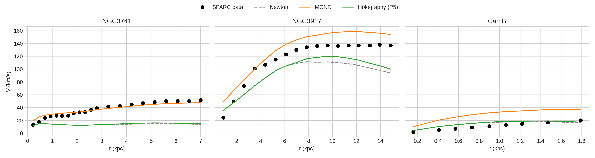
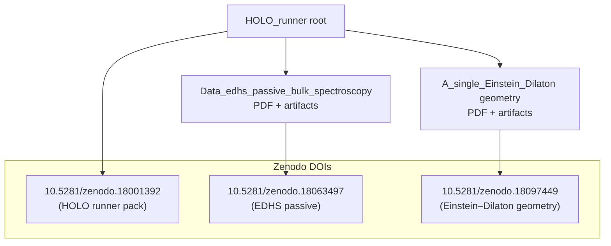

# HOLO_runner (Verification Pack)

This public repository is a **verification-only pack** for the holographic preprint.
It ships **frozen artefacts** (JSON aggregates and final figures) plus scripts that
recompute only the reported summary metrics using public data (SPARC, Bullet Cluster,
Planck 2018). It does **not** contain the private solver or any internal pipelines.
The exact snapshot packaged here is also archived at Zenodo for long-term reference:
- HOLO runner verification pack: [10.5281/zenodo.18001392](https://doi.org/10.5281/zenodo.18001392)
- EDHS passive bulk spectroscopy preprint: [10.5281/zenodo.18063497](https://doi.org/10.5281/zenodo.18063497)
- A single Einstein–Dilaton geometry (QCD, SPARC, growth): [10.5281/zenodo.18097449](https://doi.org/10.5281/zenodo.18097449)
For SPARC verification details (definition alignment that resolved early mismatches), see `docs/SPARC_VERIFICATION_NOTE.md`.

## Preview (frozen figure)




## Repository metadata (for GitHub settings)

- Description: Verification-only pack for the HOLO preprint: frozen artefacts + scripts to recompute reported summary metrics (SPARC, growth/BOSS, Ricci, Bullet Cluster). Zenodo: 10.5281/zenodo.18001392 | 10.5281/zenodo.18063497 | 10.5281/zenodo.18097449
- Website: https://doi.org/10.5281/zenodo.18001392
- Topics (enter separately, lowercase): cosmology, sparc, reproducibility, verification, holography, python

## Repository layout

- `data/internal/` – frozen JSON summaries (SPARC, cosmology, Ricci, Bullet Cluster)
- `figures/` – final figures from the preprint (frozen outputs)
- `tools/` – verification scripts (no generation)
- `repro/` – traceability map and reproduction instructions
- `Data_edhs_passive_bulk_spectroscopy/` – frozen artefact pack for the EDHS passive bulk spectroscopy note (PDF + figures + JSON)
- `A_single_Einstein_Dilaton geometry/` – frozen artefact pack + PDF for “A single Einstein–Dilaton geometry linking hadron spectra, galaxy rotation curves, and cosmological growth”

## Additional pack

- `Data_edhs_passive_bulk_spectroscopy/` – operator-level passive bulk spectroscopy pack (Phase A + supplementary Phase B maps).
- `A_single_Einstein_Dilaton geometry/` – full preprint + verification artifacts (QCD spectrum, SPARC forward eval, growth/BOSS DR12, YM scale).

## Quick navigation (clickable)



## Usage

1. Install Python 3.10+ (no special dependencies required).
2. Run the verification suite:

```bash
cd HOLO_runner
python3 run_repro.py --sparc-dir /path/to/SPARC/sparc_175
```

The script reruns only the verification checks:
- Newton baseline χ² proxy (from public SPARC CSVs)
- Ricci lock summary (frozen JSON)
- Cosmology robustness summary (frozen JSON)
- Bullet Cluster summary (frozen JSON)

All figures referenced in the preprint are provided in `figures/` as frozen outputs;
no regeneration is attempted here.
