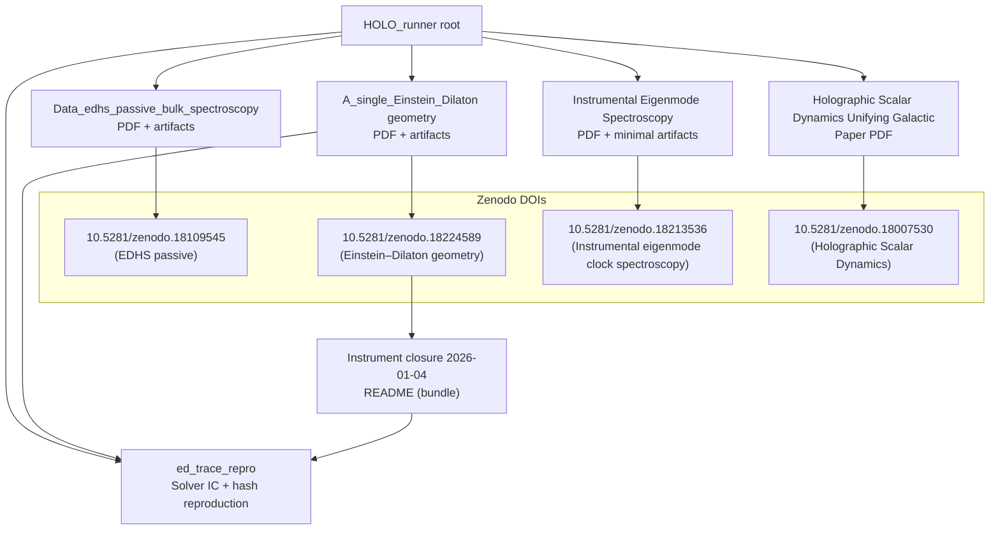
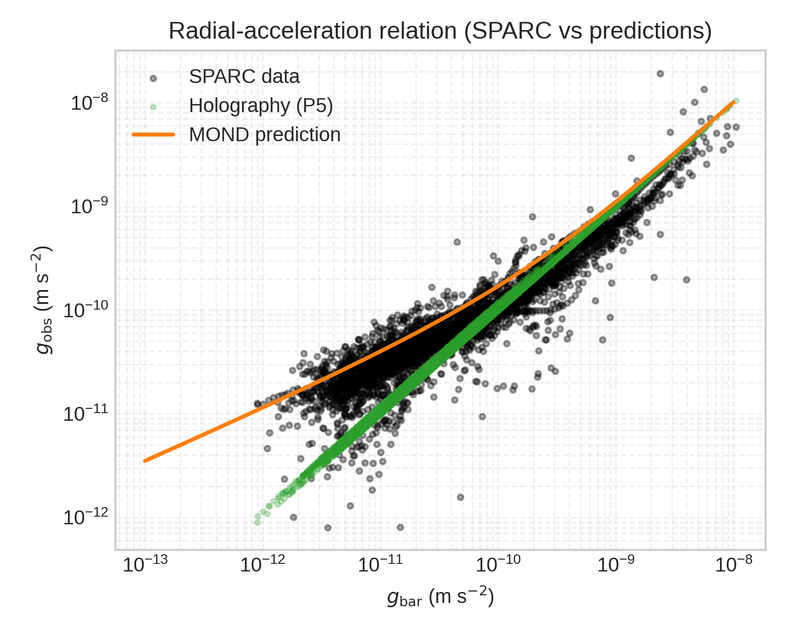

# HOLO_runner (Verification Pack)

## Mermaid system map (clickable)


```mermaid
flowchart TD
    A["HOLO_runner root"] --> B["Data_edhs_passive_bulk_spectroscopy<br/>PDF + artifacts"]
    A --> D["A_single_Einstein_Dilaton geometry<br/>PDF + artifacts"]
    A --> HSD["Holographic Scalar Dynamics Unifying Galactic<br/>Paper PDF"]
    A --> E["Instrumental Eigenmode Spectroscopy<br/>PDF + minimal artifacts"]
    A --> R["ed_trace_repro<br/>Solver IC + hash reproduction"]

    subgraph Zenodo DOIs
        Z1["10.5281/zenodo.18109545<br/>(EDHS passive)"]
        Z2["10.5281/zenodo.18224589<br/>(Einstein–Dilaton geometry)"]
        Z3["10.5281/zenodo.18213536<br/>(Instrumental eigenmode clock spectroscopy)"]
        Z4["10.5281/zenodo.18007530<br/>(Holographic Scalar Dynamics)"]
    end
    B --> Z1
    D --> Z2
    E --> Z3
    HSD --> Z4
    Z2 --> IC["Instrument closure 2026-01-04<br/>README (bundle)"]
    D --> R
    IC --> R

    click B "https://github.com/RAPIDENN/HOLO_runner/tree/master/Data_edhs_passive_bulk_spectroscopy" "Open on GitHub"
    click D "https://github.com/RAPIDENN/HOLO_runner/tree/master/A_single_Einstein_Dilaton%20geometry" "Open on GitHub"
    click HSD "https://github.com/RAPIDENN/HOLO_runner/tree/master/Holographic%20Scalar%20Dynamics%20Unifying%20Galactic" "Open on GitHub"
    click E "https://github.com/RAPIDENN/HOLO_runner/tree/master/Instrumental%20Eigenmode%20Spectroscopy%20of%20a%20Holographic%20Einstein--Dilaton%20Bulk%20Using%20Optical%20Clocks" "Open on GitHub"
    click R "https://github.com/RAPIDENN/HOLO_runner/tree/master/ed_trace_repro" "Open ED trace reproduction"
    click IC "https://github.com/RAPIDENN/HOLO_runner/blob/master/instrument_closure/2026-01-04/README.md" "Open instrument closure"
    click Z1 "https://doi.org/10.5281/zenodo.18109545" "Open Zenodo"
    click Z2 "https://doi.org/10.5281/zenodo.18224589" "Open Zenodo"
    click Z3 "https://doi.org/10.5281/zenodo.18213536" "Open Zenodo"
    click Z4 "https://doi.org/10.5281/zenodo.18007530" "Open Zenodo"
```

## HOLO-TRANSDUCER v3.0 // Architecture & Workflow

This repository represents the **verification layer** of the holographic instrument.

It only exposes the test conditions required to validate or refute the results.

Complete overview including Topo-Fractal Physics, 3D Visualization, and Data Acquisition with Secure IP/PI Censoring.

[](https://debian-gamma.vercel.app)

The UI provides real-time spectral, phase-space, and geometric readout of the frozen Einstein–Dilaton background used in the Zenodo-archived verification bundles.

This public repository is a **verification-only pack** for the holographic preprint.
It ships **frozen artefacts** (JSON aggregates and final figures) plus scripts that
recompute only the reported summary metrics using public data (SPARC, Bullet Cluster,
Planck 2018). It does **not** contain the solver source or any internal pipelines.
The `ed_trace_repro/` folder records a minimal external-solver reproduction check:
given the referenced solver commit and canonical initial conditions, the frozen
Einstein-Dilaton trace hash is reproduced exactly.
Associated paper bundles are archived at Zenodo for long-term reference:
- EDHS passive bulk spectroscopy preprint: [10.5281/zenodo.18109545](https://doi.org/10.5281/zenodo.18109545)
- A single Einstein–Dilaton geometry (QCD, SPARC, growth): [10.5281/zenodo.18224589](https://doi.org/10.5281/zenodo.18224589)
- Instrumental eigenmode clock spectroscopy preprint: [10.5281/zenodo.18213536](https://doi.org/10.5281/zenodo.18213536)
- Holographic Scalar Dynamics Unifying Galactic preprint: [10.5281/zenodo.18007530](https://doi.org/10.5281/zenodo.18007530)
For SPARC verification details (definition alignment that resolved early mismatches), see `docs/SPARC_VERIFICATION_NOTE.md`.

## Repository metadata (for GitHub settings)

- Description: Verification-only pack for the HOLO preprint: frozen artefacts + scripts to recompute reported summary metrics (SPARC, growth/BOSS, Ricci, Bullet Cluster). Zenodo: 10.5281/zenodo.18109545 | 10.5281/zenodo.18224589 | 10.5281/zenodo.18213536 | 10.5281/zenodo.18007530
- Website: https://doi.org/10.5281/zenodo.18007530
- Topics (enter separately, lowercase): cosmology, sparc, reproducibility, verification, holography, python

## Repository layout

- `data/internal/` – frozen JSON summaries (SPARC, cosmology, Ricci, Bullet Cluster)
- `figures/` – final figures from the preprint (frozen outputs)
- `tools/` – verification scripts (no generation)
- `repro/` – traceability map and reproduction instructions
- `ed_trace_repro/` – minimal external-solver reproduction check for the frozen ED trace hash
- `instrument_closure/` – auditable “instrument closure” bundles (Wilson-loop scale → SPARC → growth/BOSS → Ricci clock → UV projection)
- `Data_edhs_passive_bulk_spectroscopy/` – frozen artefact pack for the EDHS passive bulk spectroscopy note (PDF + figures + JSON)
- `A_single_Einstein_Dilaton geometry/` – frozen artefact pack + PDF for “A single Einstein–Dilaton geometry linking hadron spectra, galaxy rotation curves, and cosmological growth”
- `Holographic Scalar Dynamics Unifying Galactic/` – paper PDF bundle (manuscript only)

## Additional pack

- `Data_edhs_passive_bulk_spectroscopy/` – operator-level passive bulk spectroscopy pack (Phase A + supplementary Phase B maps).
- `A_single_Einstein_Dilaton geometry/` – full preprint + verification artifacts (QCD spectrum, SPARC forward eval, growth/BOSS DR12, YM scale).

## Usage

1. Install Python 3.10+ (no special dependencies required).
2. Run the verification suite:

```bash
cd HOLO_runner
python3 run_repro.py --sparc-dir /path/to/SPARC/sparc_175
```

To verify specific releases:

```bash
# Core pack (default)
python3 run_repro.py --suite core --sparc-dir /path/to/SPARC/sparc_175

# Zenodo verification bundle + instrument closure checks (no SPARC required)
python3 run_repro.py --suite zenodo_18141795

# Run both suites
python3 run_repro.py --suite all --sparc-dir /path/to/SPARC/sparc_175
```

The script reruns only the verification checks:
- Newton baseline χ² proxy (from public SPARC CSVs)
- Ricci lock summary (frozen JSON)
- Cosmology robustness summary (frozen JSON)
- Bullet Cluster summary (frozen JSON)
- UV-screened NIST channel consistency (frozen JSON)
- Frozen ex-ante local eigenmode holdout:
  `python3 tools/verify_eigenmode_holdout.py`
  checks that `eps=0.0` stays flat, `eps=0.02` selects the same top-3 modes
  (`[0, 3, 8]`) in both local NIST channels, and the usable `rocit` holdout
  rows remain phase-null

All figures referenced in the preprint are provided in `figures/` as frozen outputs;
no regeneration is attempted here.

## ED trace reproduction bridge

The frozen Einstein-Dilaton trace used across the artifacts can be reproduced
from the referenced external solver commit and canonical initial conditions:

```bash
./ed_trace_repro/reproduce_trace.sh
```

See [`ed_trace_repro/`](./ed_trace_repro/) for the initial-condition file,
expected SHA256, solver commit, and interpretation notes. This bridge verifies
computational reproducibility of the frozen trace; it is not a proof of the
physical model.

## Frozen figures



## Instrument Closure (Zenodo 18224589 specification)

This repository remains **verification-only**. Zenodo record `https://doi.org/10.5281/zenodo.18224589` and the bundled PDF
`A_single_Einstein_Dilaton geometry/A_single_Einstein-Dilaton_geometry.pdf` are treated as the **scientific specification** of an auditable instrument run.

The instrument closure circuit recorded here is:

Wilson loop → σ_eff → frozen ED geometry → SPARC → fσ₈ → 5D Ricci clock → UV-screened laboratory projection.

### Instrument closure 2026-01-04 (sanitized bundle)

Includes an additional QCD glueball (0⁺⁺, m₁/m₀) verification channel from the frozen Einstein–Dilaton geometry pack.
- External audited channel (not copied into `instrument_closure/2026-01-04/`): `A_single_Einstein_Dilaton geometry/artifacts/invariant_flux_spectrum_u.json` (hash-audited via `instrument_closure/2026-01-04/instrument_closure_manifest.json:external_channels`).
- LAB/NIST clock inputs are archived at Zenodo `10.5281/zenodo.18147532` and are hash-audited in `instrument_closure/2026-01-04/instrument_closure_manifest.json:external_channels`.
- Manifest (bundle-local hashes + pointers): `instrument_closure/2026-01-04/instrument_closure_manifest.json`
- Wilson-loop absolute scale from frozen ED trace (Eq. 13–16): `instrument_closure/2026-01-04/wilson_loop_sigma_from_ed_trace.json`
- HK-core gauge-kernel decision run (IR-Lmax verdict): `instrument_closure/2026-01-04/hkcore_refine_beta2.0_seed777.json`
- SPARC fixed-IC ED evaluation output: `instrument_closure/2026-01-04/ed_fixed_ic_sparc_eval.json`
- Growth readout series (HOLO vs ΛCDM): `instrument_closure/2026-01-04/growth_report.json`
- BOSS DR12 covariance validation: `instrument_closure/2026-01-04/growth_validation_boss_dr12.json`
- 5D Ricci bulk clock product: `instrument_closure/2026-01-04/ed_bulk_clock.json`
- UV projection kernel: `instrument_closure/2026-01-04/k_em_uv_projector.json`
- UV-projected NIST comparison report: `instrument_closure/2026-01-04/nist_comparison_uv.json`

### Key outcomes (from the bundle)

- Wilson-loop scale: σ_eff = 0.2031359 GeV², m₀ = 1.600006 GeV
- SPARC (175): successes = 172/175, median χ²_holo = 0.5650, median χ²_newton = 1.9279
- Growth/BOSS DR12: χ²_HOLO = 2.2684, χ²_ΛCDM = 2.4430, Δχ² = −0.1746; predicted Δfσ₈(z=1) = −12.339%
- UV-projected lab channel vs NIST: Pearson r = −0.0554 (no detection-level correlation in the UV-screened baseline)
