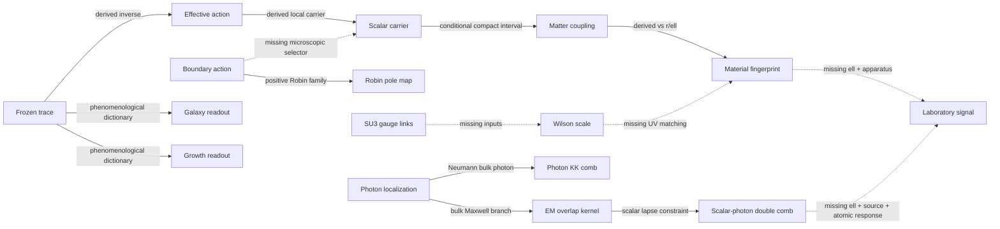

# Master prediction registry

This is the executable evidence map for the current HOLO prediction programme. It is intentionally fail-closed: a computational link is not promoted to a physical link merely because both endpoints exist.

## Link graph

| Link | Class | Gate | Meaning |
|---|---|---|---|
| `trace_to_effective_action` | `derived_inverse` | `passed` | The achieved profiles admit a positive-kinetic Einstein-scalar completion on the certified interval. |
| `effective_action_to_scalar_carrier` | `derived_local` | `passed` | The healthy gauge-invariant trace carrier follows locally from the completed action. |
| `boundary_selects_spectrum` | `conditional_unselected` | `blocked_missing_boundary_action` | NN, ND, DN and DD are numerical alternatives; data may not select one after the fact. |
| `positive_robin_action_to_phase_map` | `derived_family_unselected` | `passed_family_scan_missing_microscopic_boundary_coefficients` | Positive quadratic endpoint terms map poles and UV residues; IR stiffness alone cannot lift the light mode, while UV stiffness causes a residue exchange through an avoided crossing. |
| `carrier_to_matter_coupling` | `derived_given_compact_interval_and_uv_probe` | `conditional` | beta_n=sqrt(I_g/3) f_n on the declared UV probe slice. |
| `matter_to_dimensionless_force` | `derived_for_positive_nn_benchmark_modes` | `passed_as_benchmark_not_physical_branch` | A frozen correlated Yukawa force and gradient fingerprint versus x=r/ell. |
| `dimensionless_force_to_lab_signal` | `blocked` | `missing_ell_source_detector_and_noise_model` | No metres, newtons, displacement or significance can be predicted until these independent inputs are frozen. |
| `photon_action_to_em_kernel` | `derived_family_conditional_on_bulk_photon` | `bulk_or_brane_photon_branch_unselected` | Eq. 39 is the conformal-coordinate form of the minimal bulk-Maxwell measure. The historical numerical kernel mixed conformal and domain-wall coordinates and is rejected. |
| `em_kernel_to_double_comb` | `derived_given_bulk_photon_and_comoving_boundaries` | `passed_as_conditional_dimensionless_template` | The scalar lapse constraint fixes d_gamma,n and the same interval fixes a photon KK tower; no free c_gamma is fitted at the Z=1 point. |
| `bulk_photon_to_photon_kk_tower` | `derived_given_bulk_photon` | `passed_as_conditional_dimensionless_template` | Neumann bulk Maxwell data give a flat massless photon plus a correlated massive vector comb with UV charge residues. |
| `em_double_comb_to_clock_signal` | `blocked_dimensional_readout` | `missing_ell_source_atomic_coefficients_and_physical_branch_selection` | The normalized source-to-alpha transfer is derived, but hertz and significance still require a physical branch, ell, a source and atomic differential sensitivities. |
| `trace_to_galaxy_readout` | `phenomenological_dictionary` | `retrospective_cross_validation_only` | Five global parameters are fitted on train galaxies; this is not a field-equation derivation. |
| `trace_to_growth_readout` | `phenomenological_dictionary` | `external_diagnostic_not_full_likelihood` | The frozen curve can be scored, but a 4D cosmological interface has not been derived. |
| `gauge_links_to_wilson_observable` | `blocked` | `missing_su3_link_configurations` | Rectangular loops, Creutz ratios and a continuum scale cannot be recovered from plaquette summaries or an ED endpoint proxy. |
| `qcd_scale_to_compactification_length` | `blocked` | `missing_uv_matching_relation_ell_sqrt_sigma` | Setting ell equal to a lattice spacing or QCD length would be an additional physical hypothesis. |

## Results already generated

- **Boundary audit:** ND has an independently checked ultralight mode `mu=0.00274476` with `beta_UV=0.054291`. NN has the massless mode; DN/DD decouple an exact UV point probe. No branch has been selected.
- **Material fingerprint:** 6 positive NN benchmark modes predict `sum(alpha)=7.2023e-05` and a correlated decay versus `r/ell`; no dimensional signal is claimed.
- **Positive Robin family:** IR stiffness alone leaves `mu_0<=0.00274498`. UV stiffness produces an avoided crossing with residue exchange; its minimum first-pair gap is `0.0119229`. The endpoint coefficients remain unselected theory inputs.
- **SPARC retrospective cross-validation:** P5 beats baryons-only Newton in `81.5%` of test galaxies but beats RAR in only `29.6%`; its test delta log-likelihood per point relative to RAR is `-71.1328`. This is development evidence, not blind confirmation.
- **DESI DR1 marginal diagnostic:** diagonal chi2 is `2.69172` for the frozen HOLO dictionary and `2.41886` for matched LCDM (`delta=0.272857`). This is not the official full likelihood and gives no preference for HOLO.
- **Eq. 39 electromagnetic kernel:** the minimal bulk-Maxwell measure is coordinate covariant to `6.26865e-12`. The historical numerical kernel used domain-wall `u` as conformal `z` and differs from the correct `Z=1` `u`-kernel by `0.395739`; that old projection is rejected.
- **Scalar-photon double comb:** the first positive bulk-photon masses are `0.652597, 1.30143, 1.93925`. The scalar lapse fixes branch-dependent `d_gamma,n`, while all photon and scalar masses share the same still-free `ell`. This is a conditional dimensionless fingerprint, not a detected signal.
- **Wilson route:** `blocked_missing_link_configurations`. The analyser is ready and tested, but no rectangular-loop result or string tension can be computed from the available summaries.

## Next falsifiable runs

1. **physical_boundary_selection** — freeze: boundary/junction action and matter slice. Output: one selected spectrum or an explicit proof that this compactification fails.
2. **bulk_photon_double_comb_test** — freeze: bulk photon localization, ell, electrostatic source geometry, clock species and distance bins. Output: joint Coulomb, scalar-force and differential-clock template with shared mass ratios.
3. **dimensional_material_scan** — freeze: ell, source geometry, detector transfer and distance bins. Output: absolute force/displacement curve and null arms.
4. **wilson_ensemble_export** — freeze: thermalized SU(3) links, action, beta values and blocking plan. Output: W(R,T), V_eff, Creutz plateaux and continuum sigma.
5. **prospective_external_observation** — freeze: model, likelihood, masks and nuisance policy. Output: a preserved external holdout result, including a null or failure.

The JSON beside this document contains all exact values, relative paths, and SHA-256 hashes.
