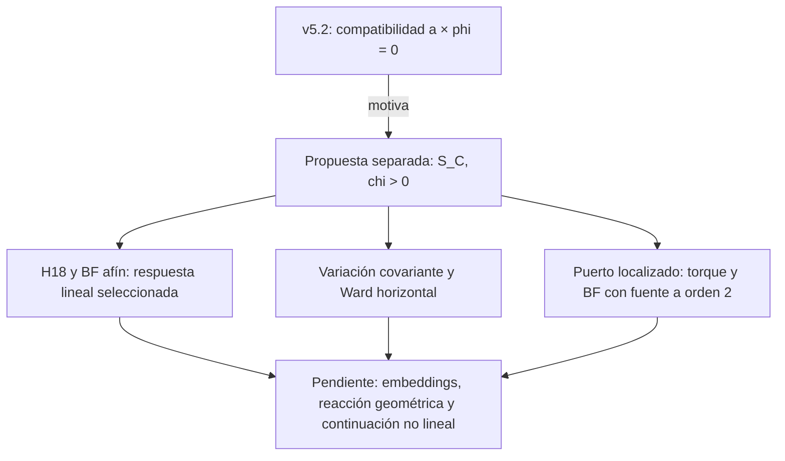

# Revisión de la propuesta de corriente de conexión

Estado de trabajo a 2026-09-08. Este índice reúne pruebas concretas y sus
límites; no es una promoción de los gates del charter. Los commits citados
son locales. La acción congelada v5.2 no se ha modificado y la propuesta
no tiene un valor elegido para su nuevo coeficiente.

## Problema demostrado en la acción congelada

El BF con conexión común y salto B nulo obliga a que la corriente normal
material total se anule. Con Robin, esto exige a×phi=0. Alrededor de
a0=phi0=0, la restricción empieza en segundo orden y resulta invisible en
el Hessiano lineal. La respuesta material da ganancias distintas a dos
longitudes de onda; su mezcla puede producir un torque que ninguna
corrección de segundo orden de a o phi puede cancelar.

La prueba se ha localizado con un puerto suave compacto y energía espacial
finita. Conserva una cota estricta |rho2(x_star)|>197/640 para el testigo
R=256. Es una obstrucción a esos datos prescritos; no es una afirmación de
que todas las soluciones de la teoría sean inconsistentes ni una solución
Einstein completa. Véase [compatibilidad BF/Robin](one_omega_bf_robin_compatibility_lemma_v1.md)
(commits `a724b81`, `aeaeba3`).

## Corrección de orientación de la extensión

La [errata de orientación](one_omega_connection_orientation_erratum_20260908.md)
explica un fallo real de los recibos anteriores de corriente y levantamiento.
Con vol5=dn wedge volSigma, la acción literal +int B3 wedge F produce
+[b] wedge delta A. El signo textual opuesto no había sido detectado por
las pruebas homogéneas con [b]=0. Una nueva derivación de Stokes, un
oráculo integrado en ambas mitades y la variación material reducida
fijan ahora [b]=-J_Sigma y chi DeltaTheta=-rho2. Los recibos corregidos
sustituyen a los anteriores; las normas sobreviven al cambio de signo.
El H18 y las fórmulas covariantes mantienen su contenido algebraico.

## Propuesta separada y resultados verificados

Se estudia

    S_C = -chi/2 integral <C wedge *C>, C=A_Sigma-omega(gamma,T), chi>0.

A_Sigma sigue siendo independiente. Su corriente J_Sigma=chi*C modifica
la ecuación natural a b_plus-b_minus=-J_Sigma y exige
D_A J_Sigma=[j4]. La opción de imponer A=omega a mano no es esta propuesta.
El término, su coeficiente y sus dominios deben juzgarse como una acción
extendida; no se heredan los gates de la acción anterior.

| Pieza | Resultado y dominio | Validación / commit |
|---|---|---|
| [Mecanismo de corriente](one_omega_interface_connection_current_candidate_lemma_v1.md) | Corriente covariante, signo de salto y canal con geometría fija. | 18 pruebas, 26 checks / `82fa15c` |
| [Conexión proyectada](one_omega_projected_connection_linear_lemma_v1.md) | Las 36 entradas lineales; el término modifica shift y gradientes métricos. | 17 pruebas / `0d937a9` |
| [Respuesta H18](one_omega_connection_candidate_response_lemma_v1.md) | Ensamblado completo; respuestas seleccionadas sin ceros en Re(s)>0, q>0, y carta q=0 directa. | 18 pruebas, 38 identidades / `82fa15c` |
| [Variación covariante](one_omega_connection_current_covariant_variation_lemma_v1.md) | Corriente, adjunto métrico, Euler de T y borde; marco dependiente retenido. | 17 pruebas, 28 checks / `82fa15c` |
| [Ward horizontal](one_omega_connection_horizontal_ward_lemma_v1.md) | Identidad difeomorfa off shell con el término div(G_H)/2; oráculo realmente curvo. | 17 pruebas, 32 checks / `82fa15c` |
| [BF afín lineal](one_omega_connection_affine_bf_reconstruction_lemma_v1.md) | Biyección de un cociente por fibra Re(s)>0, con theta preservada y dominio graph explícito. La fuente bulk es cero en este orden. | 20 pruebas, 36 checks / `82fa15c` |
| [Torque localizado](one_omega_connection_localized_torque_lift_lemma_v1.md) | Fuente rho2=curl W con media cero; solución Theta L2 y de energía finita que cancela la compatibilidad a segundo orden. | 19 pruebas, 18 identidades / `82fa15c` |
| [BF estático con fuente](one_omega_connection_static_sourced_bf_lemma_v1.md) | Reconstrucción de B2 con corriente material real y salto; normas auxiliares integradas en R3 y ambas mitades BPS. | 20 pruebas, 53 checks / `82fa15c` |
| [Forma cinética ADM](one_omega_connection_adm_kinetic_lemma_v1.md) | Sección suave E(h), Hessiana añadida semidefinida positiva de rango 3; sin velocidades de lapse/shift. Schur sólo cinético. | 17 pruebas, 40 checks / `82fa15c` |
| [Carta vectorial temporal](one_omega_connection_vector_temporal_gauge_lemma_v1.md) | N_a=0 conserva todas las filas con fuentes compatibles; reconstrucción acotada uniformemente en q>=0 a s fijo en Re(s)>0. | 18 pruebas, 42 checks / `82fa15c` |
| [Reacción métrica cuadrática](one_omega_connection_quadratic_metric_feedback_lemma_v1.md) | Fuente de la acción mixta, Ward y norma exacta; cota inferior para continuaciones estáticas con C0=C1=0 y G2=rho. | 20 pruebas, 24 checks / `f2c277c` |

Cada paquete incluye una nota analítica, verificador, pruebas y recibo JSON
ligado a los bytes de sus fuentes. Tras la corrección se ejecutaron 164 pruebas de la cadena afectada, más
20 de la reacción métrica. En estas entregas, `--write` y una
recomputación `--verify` coinciden. El número de checks no sustituye las
hipótesis ni las demostraciones analíticas de las notas.

## Qué aportan las respuestas y el levantamiento localizado

Coordenadas radiales: en los lemas espectrales y variacionales, r es la
distancia propia: ds5²=dr²+Omega² eta4 y Omega_r=−k Omega exp(−aOmega²).
En la reconstrucción estática con fuente, z es la coordenada conforme:
dr=Omega dz y Omega_z=−k Omega² exp(−aOmega²). Las pesas de formas y sus
medidas se transforman juntas. No se deben mezclar estas dos derivadas.

En la carta q>0, los nuevos factores tensorial y escalar son
F_T+chi*q² y D_zeta+2chi*q². Para las dos orientaciones transversas,

    D_theta=Keff*s²+chi*q²,
    Keff=2chi*B/(2B+chi), B=b+m(s²+q²).

La representación Stieltjes con medida finita da una cota estricta

    Re(D_theta/s) >= Re(s)[2chi*b/(2b+chi)+chi*q²/|s|²] > 0.

El pivote del shift no es nulo, pero su reconstrucción en H_a3=0 divide
por q. La carta temporal N_a=0 resuelve esa limitación para la misma
respuesta: U=qN+wH y Psi=theta-oH/2 dan H=U/w, sin dividir por q.
Conserva el pivote (2B+chi)/4 y el determinante w² P_U S_Psi; a q=0
coincide con la matriz directa diag(Bw²/2,chi*w²). Las cotas forzadas
son uniformes en q>=0 a cada s fijo en Re(s)>0, con la compatibilidad
f_N=(q/w)(f_H+o f_theta/2). Esto no proporciona control del eje
imaginario, de todo |s|, ni una reconstrucción Sobolev global del bulk.

Para el puerto estático localizado F, el material responde con
U=g(|D|)F, g(p)=kappa/(kappa+2Zp). La fuente cuadrática real es
rho2=kappa*y² grad F×grad U=curl(kappa*y² F grad U). El potencial
Theta_hat=+rho2_hat/(chi|k|²) pertenece a L2 gracias a esa media cero,
y tiene energía espacial finita. Su conexión exponencial es plana exacta.
La compatibilidad de corriente a ese orden queda satisfecha. Esto no
convierte al lapse prescrito en una solución libre de las ecuaciones de
Einstein: su reacción métrica es una obligación distinta.

La respuesta lineal y el cociente BF tienen una unión concreta: al tirar
la variación de la acción a A=-d theta, delta A=-d(delta theta), la fila
Euler de theta es -dJ. Por tanto una solución de las filas de theta de
H18 sin fuente externa en esas filas cumple precisamente la condición que
necesita la reconstrucción afín. Si H18*u=f con f_theta distinto de cero,
la ecuación es -dJ=f_theta y hay que incorporar esa fuente: el lift con
J4_bulk=0 no se aplica automáticamente. En el
mismo dominio regular por fibra, ésta aporta A y B, y dos extensiones con
los mismos datos difieren por los gauges relativos declarados. Esta
composición no amplía el dominio graph, no elimina theta y no construye
las filas de embeddings que aún faltan.

## Completaciones verificadas y fronteras pendientes

La reconstrucción estática con fuente ya está comprobada. La homotopía
espacial h=-i i_xi/|xi|² aplicada al producto material completo da
B2=-hJ4 en cada mitad. En este puerto, J_Sigma=+h[j4] y el resto cerrado
L=J_Sigma-h[j4] se anula exactamente, de modo que el campo particular ya
satisface el salto -J_Sigma. Las cotas de baja frecuencia y de decaimiento radial
dan normas auxiliares integradas finitas para B2 y dB2, por unidad de tiempo
coordenado. No se sustituye s=0 por la homotopía 1/s ni se presenta esa
norma auxiliar como energía física de B. Esto completa ese sector BF a
segundo orden, con la geometría prescrita y las hipótesis de la nota.

La forma cinética ADM también está verificada. En una carta T=t regular
y una sección suave E(h), la parte de velocidades es
c/2 |q_g-L_E(hdot)-B_sp|², c=chi*sqrt(det h)/N>0. Su Hessiana añadida
es una matriz Gram de rango tres, semidefinida positiva y sin filas de
velocidad para lapse o shift. Un oráculo anisótropo impide congelar el
marco: el acoplamiento a hdot no es cero en general. Su Schur en las
velocidades de orientación se anula, pero eso no elimina la ecuación
diferencial del campo g ni constituye el análisis Dirac completo.

La reacción métrica de la conexión ya está calculada para el puerto:
tau_C,ij^(2)=chi partial_(i(curlTheta)_(j)) y div tau_C^(2)=-curl rho/2.
Su norma espacial satisface ||tau_C^(2)||²=||rho||²/2, aunque la energía
del canal de orientación disminuya como 1/chi. La proyección vectorial
del Ward prueba además la cota inferior correspondiente para cualquier
continuación estática compatible, incluso con omega2 no nula, bajo
C0=C1=0 y G2=rho. Es una norma de la contribución de conexión, no la
energía física total. Su reacción lineal ya pertenece al H18 y no debe
contarse una segunda vez al construir una fuerza cuadrática.

Siguen abiertos el mapa completo de variación con embeddings, la reacción
geométrica del puerto, la continuación no lineal, las ligaduras y el conteo
físico completo, la estabilidad global y los sectores topológicos/BV/BFV.
Una identidad de Ward local no decide por sí sola esas cuestiones. No se
promueven N4/N7/P4 ni B4/B5. Tampoco se deduce capacidad de aprendizaje o
control físico de los resultados matemáticos de este índice.

## Refutación externa y siguiente auditoría

Claudia ha reproducido independientemente el núcleo de la obstrucción y
un segundo testigo no colineal (commit `5340e4d`). Aceptó y registró las
dos precisiones de alcance en `4c63343`: ganancias diferentes no producen
torque si los gradientes son paralelos, y la consecuencia original
requiere salto B nulo/corriente intrínseca J_Sigma nula. La factorización
(g_B-g_A) grad F1×grad F2 expresa ambas posibilidades sin ambigüedad.

En `d511efa` reconstruyó la ecuación maestra escalar desde sus ODEs bulk
independientes. Eso contrasta el operador y las pesas relativas Omega^6
frente a Omega^4. No fija por sí solo la normalización multiplicativa
G ni el factor bilateral de la acción: esa normalización requiere
la auditoría canónica de la acción descrita a continuación. La reducción escalar L3 conserva también una auditoría pendiente.

La revisión del primer cálculo canónico de Claudia (`939c616`) detectó
que convertía datos de borde en constantes y omitía jets tangenciales en
los momentos radiales. Ese recibo queda sustituido por `b088c5a`: conserva
los campos de borde como funciones, deriva el representante ADM y suma
GHY antes de variar. Sus seis momentos/corrientes coinciden con nuestro
oráculo manual; esta afirmación es una revisión de lectura de su cálculo.
El paso de J_P a J_Z usa la ligadura C_m=0 y E44, sin dividir por box.
La comprobación desde su fila E44 conserva explícitamente el resto
(12M-G)a0*C_m fuera de esa capa.

La comprobación estática para todo q>0 usa los decimales congelados como
racionales exactos y un margen positivo verificado de aproximadamente
3.38e-16 en E0<=2(2+m0). No se identifica ese margen con igualdad por un
matching histórico. Sustituir q>0 por q>delta excluiría momentos que la
interfaz R1,3 permite y cambiaría el teorema; cualquier robustez frente
a perturbaciones de parámetros requiere su propio análisis infrarrojo.

Las auditorías de lectura no se cuentan como recomputaciones independientes.
Una auditoría pendiente no equivale a un resultado favorable.
