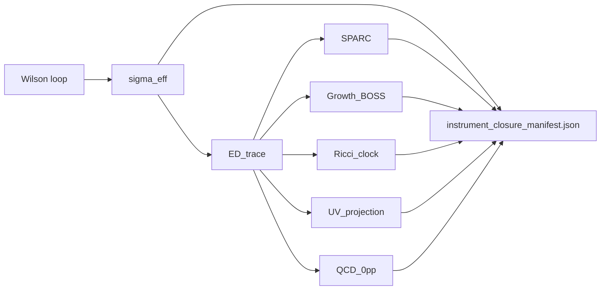

# Instrument closure 2026-01-04 (verification-only)

This directory is the dated **instrument closure** for the holographic instrument specified by
`A_single_Einstein_Dilaton geometry/A_single_Einstein-Dilaton_geometry.pdf` (Zenodo `10.5281/zenodo.18141795`).
It contains frozen readouts (JSON) plus a manifest; it does **not** contain the private ED solver or any generation pipeline.
All channels are auditable via `instrument_closure_manifest.json` and verifiable as frozen artefacts (with some channels referencing external inputs by recorded hashes).
The QCD glueball (0⁺⁺) channel is provided by the frozen spectrum artefact in the Einstein–Dilaton geometry pack and is referenced here as an external audited channel.

Legend:

- `ED_trace`: frozen Einstein–Dilaton geometry trace ID used across channels.
- `sigma_eff`: Wilson-loop absolute scale readout.
- `QCD_0pp`: QCD glueball scalar `0++` ratio `m1/m0` (scale-free).

External audited channels (not copied into this folder):

- QCD glueball 0⁺⁺ ratio `m1/m0`: `A_single_Einstein_Dilaton geometry/artifacts/invariant_flux_spectrum_u.json` (hash-audited via `instrument_closure_manifest.json:external_channels`).

External inputs (Zenodo-archived):

- LAB/NIST clock inputs are archived at Zenodo `10.5281/zenodo.18147532` and are hash-audited in `instrument_closure_manifest.json:external_channels` (and referenced in `nist_comparison_uv.json:inputs.nist_dataset`).

Note: This pipeline experimentally instantiates the paper’s multi-arm operator `J_ζ` as a frozen, hash-audited readout channel.
